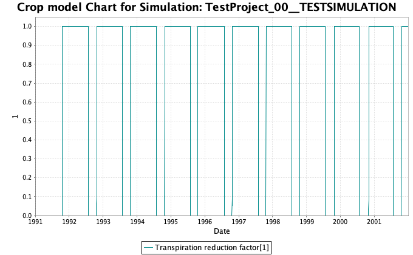
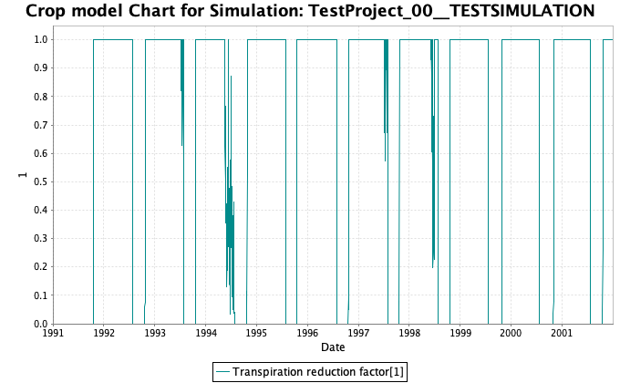

# **PROTOCOL**

**DROUGHT STRESS**

**LINTUL2-SLIM WATERSTRESS MODEL**

**DATE:** 04.07.2023

**SOFTWARE:** SIMPLACE

## **OBJECTIVE**

Run a model with and without water stress. Compare the annual yields and try to compensate yield loss by irrigation. The yearly yields should always be **more than 90%** of the potential yearly yields.

Calculate the **overall water use efficiency** (sum of yields divided by sum of irrigation amounts) and try to maximize it by varying amounts and irrigation dates. Consider only those simulations as valid, where the yearly yields are at least 90% of the potential ones.

## **MODEL**

The modeling framework SIMPLACE was used to run the crop model Lintul2 together with the soilwater model "Slim". Data and solution files were provided by the laboratory instructor. Soil parameters used were for typical sandy loam soil, and weather data id from NUTS2 region AT11 (Burgenland, Austria).

Model is shown in Figure 1.

Figure 1. Waterstress model using Lintul2 and Slim in SIMPLACE framework.

## **SOLUTIONS**

·       NoWaterstress - to calculate the potential yield without water stress

·       Waterstress - to calculate yield under water stress condition and irrigation on two days per year. Irrigation days and amount are the same for all years.

·       WaterstressIrrigYearly - to calculate yield under water stress condition and irrigation on two days per year. Irrigation days and amount were chosen individually per year to maximize resource efficiency.

## **BENCHMARK**

No water stress condition was achieved through running the 'NoWaterStress' solution. TranRf=1 as shown in Figure 2. Rain and irrigation chart is shown in Figure 3. Volumetric water content is shown in Figure 4. Root depth is shown in Figure 5, while LAI yearly is presented in Figure 6. Figures 7 and 8 show the annual storage biomass and sum of biomass above ground.

Notably, the overall potential yield without water stress is 8398 g/m2. And taking the 90% of this as our threshold, **7559 g/m2**, will be the limiter for rejecting or accepting irrigation schedules from this point on.

Figure 2. TranRF for all years under no water stress condition.

Figure 3. Rain and irrigation in mm.

Figure 4. Volumetric water content in m3/m3

Figure 5. Root depth in m.

Figure 6. LAI in m2/m2.

Figure 7. Biomass of Storage organs in g/m2.

Figure 8. Sum of Biomas fractions above ground in g/m2.

## SIMULATIONS

Simulations were done by adjusting the following parameters: water amount for irrigation [mm] on irrigation day 1 and/or day 2; and day of irrigation [DOY] for days 1 and/or 2.

1.  Irrig
2.  

## DECISION AND THEORY

### On uniform irrigation schedule per year

From running simulations starting from 100 mm for both irrigation days 1 and 2, and going down through increments of 10 mm, we were able to find that applying 10mm of water at DOY 1 and 10 mm at DOY 182 second half of year) is the least possible input which results to **7561 g/m2 total yield.**

### On custom irrigation schedule per year

Based on the previous simulations, the minimum amount of water supplied per year (uniform) is 20 mm to maintain a sum of **7561 g/m2** yield. From running this setting, we checked the daily data and identified July 1993, May-July 1994, June-July 1997, and June 1998 as a critical years where TranRF is very low (water stress is very high) and fluctuating; this is shown in Figure 9 to 13.

Zoom in 1993:

Zoom in 1994:

Zoom in 1997:

Zoom in 1998:

Hence, we decided to add more water at this stage. We tested runs on other years and identified we can further lower the input water to 5 mm on all the other years since TranRF is resilient up to this point.

Table 1 shows the irrigation schedule and settings we recommend for each year.

## RECOMMENDATIONS

From conducting the simulations and utilizing the SIMPLACE software with given solution files for drought stress, we wish to put forward the following recommendations for future improvements:

1.  *more realistic data with crop and other parameters specified*- we acknowledge that the aim of the project is to introduce students to basic modelling and simulation, however, providing more details, data, and editable parameters to reflect the complexity of real world would definitely help us not be shocked when we step out of the class room
2.  

## REFERENCES
